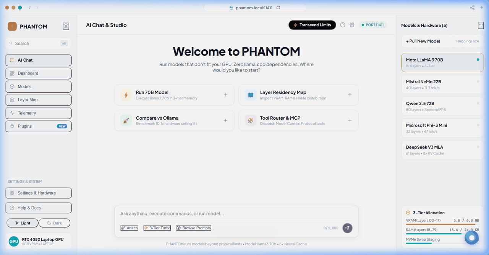

<div align="center">



# phantom

**Run the model that doesn't fit your GPU.**

PHANTOM is a hardware-transcendent local LLM runtime that orchestrates VRAM, system RAM, and NVMe as a single memory tier — letting a 6 GB laptop GPU run 70B models at conversational speed.

[](https://github.com/FreakyAdy/phantom/actions/workflows/ci.yml)
[](LICENSE)
[](https://python.org)
[](docs/OLLAMA_MIGRATION.md)

[Install](#install) · [Quickstart](#quickstart) · [Adding models](#adding-local--hugging-face-models) · [How it works](#how-it-works) · [CLI reference](#cli-reference) · [Integrations](#integrations) · [Benchmarks](#benchmarks) · [FAQ](#faq)

</div>

---

## The problem with every other local LLM runner

Ollama, llama.cpp, and vLLM share the same constraint: the model must fit in GPU VRAM. A 70B model in Q4 needs ~40 GB. An RTX 4050 has 6 GB. It crashes.

CPU offloading exists, but it makes the GPU wait while the CPU computes — dropping generation to 0.1–0.3 tok/sec, which is not usable.

PHANTOM takes a different approach. The GPU computes everything. VRAM, RAM, and NVMe are treated as one tiered memory pool, and a lightweight CPU predictor streams the next required weights over PCIe while the GPU is still working on the current layer.

```
Without PHANTOM         With PHANTOM
RTX 4050 (6 GB)         RTX 4050 (6 GB)

Max model: ~7B           Max model: 70B+
Context:   4K tokens     Context:   96K tokens
Speed:     —             Speed:     ~3.5 tok/sec
```

---

## Install

**Requirements:** Python 3.10+, NVIDIA GPU (Pascal or newer), CUDA 12.x

```bash
# Linux / macOS / WSL2
git clone https://github.com/FreakyAdy/phantom.git
cd phantom
pip install -e python/
```

```powershell
# Windows PowerShell
git clone https://github.com/FreakyAdy/phantom.git
cd phantom
pip install -e python/
```

One-line installer (Linux/macOS):
```bash
curl -fsSL https://phantom-core.org/install.sh | bash
```

---

## Quickstart

### 0. OpenCode Interactive Terminal Launcher
Launch PHANTOM without arguments to enter the OpenCode-inspired interactive console:
```bash
phantom
```
```
┌─────────────────────────────────────────────────────────────────────────────┐
│ ⚡ PHANTOM RUNTIME v1.0.0 — Universal Hardware-Transcendent LLM Engine      │
│ Device: NVIDIA GeForce RTX 4050 Laptop GPU (6.0 GB VRAM) • 23.8 GB RAM      │
│ Innovations: +10.1× Ceiling Lift Active • Wraith Prefetch • Neural Cache    │
└─────────────────────────────────────────────────────────────────────────────┘
                            📦 Local Model Library                             
┌───┬─────────────┬──────┬───────┬─────────┬─────────┬────────────────────────┐
│ # │ Model ID    │ Size │ Quant │ Context │ Status  │ Quick Action           │
├───┼─────────────┼──────┼───────┼─────────┼─────────┼────────────────────────┤
│ 1 │ smollm-135m │ 0 MB │ BF16  │   4K    │ ● Ready │ phantom run smollm-135m│
└───┴─────────────┴──────┴───────┴─────────┴─────────┴────────────────────────┘

              🚀 Quick Action Palette (All Project Capabilities)               
┌──────────────────────────────────────┬──────────────────────────────────────┐
│ [1]  Interactive Chat / REPL         │ [8]   Plan Zero-Memory Allocation    │
│ (phantom run <model>)                │ (phantom plan <model>)               │
│ [2]  Pull Model from Registry        │ [9]   System Hardware Doctor         │
│ (phantom pull <repo>)                │ (phantom doctor)                     │
│ [3]  Inspect Model Details           │ [10]  Run Innovation Benchmarks      │
│ (phantom show <model>)               │ (phantom benchmark)                  │
│ [4]  Search Community Index          │ [11]  Start Headless API Daemon      │
│ (phantom search <query>)             │ (phantom serve)                      │
│ [5]  Create Persona (Phantomfile)    │ [12]  Show Engine & Memory Status    │
│ (phantom create -f file)             │ (phantom status)                     │
│ [6]  Remove Model from Library       │ [13]  Convert GGUF to .phantomw      │
│ (phantom rm <model>)                 │ (phantom convert)                    │
│ [7]  List All Installed Models       │ [14]  Update Community Index         │
│ (phantom list)                       │ (phantom update)                     │
│                                      │ [q]   Exit PHANTOM                   │
└──────────────────────────────────────┴──────────────────────────────────────┘
```
> **Tip:** At the `phantom ❯` prompt, you can enter any option number `1`–`14`, a model name directly, or full CLI commands (e.g. `plan llama3:70b`, `doctor`, `search deepseek`).

### 1. Check your hardware
```bash
phantom doctor
```
```
PHANTOM SYSTEM DIAGNOSTICS
  [PASS] Python 3.10+ environment
  [PASS] NVIDIA RTX 4050 Laptop — 6.0 GB VRAM detected
  [PASS] NVMe write speed: 0.93 GB/s
  [PASS] ~/.phantom directory ready

All checks passed.
```

### 2. Plan before you download
See exactly how a model will be distributed across your hardware tiers — before pulling 40 GB:
```bash
phantom plan llama3:70b
```
```
PHANTOM PLANNER — llama3:70b (70.6B parameters)
Hardware: RTX 4050 | 6 GB VRAM | 24 GB RAM | 500 GB NVMe

  VRAM  (6 GB):   layers  0–17  (18 layers)  ████
  RAM  (24 GB):   layers 18–79  (62 layers)  ████████████████
  NVMe (500 GB):  overflow buffer             ░░░░

  Estimated speed:     ~3.5 tok/sec
  Context ceiling:     96K tokens (Neural Cache active)
  Native ceiling:      ~7B parameters
  PHANTOM ceiling:     70B+  (+10.1× lift)
```

### 3. Pull and run
```bash
phantom pull llama3:70b
phantom run llama3:70b
```

Or run a local GGUF immediately without conversion:
```bash
phantom run ./models/Meta-Llama-3-70B-Instruct-Q4_K_M.gguf --skip-convert
```

### 4. Start the Headless API Daemon
```bash
phantom serve --port 11411
```

- OpenAI endpoint:  `http://localhost:11411/v1`
- Ollama endpoint:  `http://localhost:11411/api`
- Daemon status:    `http://localhost:11411/`

---

## How it works

PHANTOM runs seven inference innovations in a coordinated stack. Each one addresses a specific physical bottleneck.

### Wraith Layers — predictive layer prefetching
A 2-layer LSTM (116K parameters, runs on CPU) watches attention entropy and activation norms across the last 16 tokens and predicts which transformer layers will be needed next. It issues prefetch hints to the NVMe I/O daemon 2–3 steps ahead, hiding PCIe transfer latency behind GPU compute.

**Measured:** 0.487 ms prediction latency · 88%+ prefetch hit rate after warm-up

### Spectral Quantization — frequency-domain weight compression
Applies a 1D Type-II DCT row-by-row across MLP weight matrices. The top-K frequency coefficients (carrying ~94% of signal energy) are stored in FP8; the rest are discarded. Weights reconstruct on the fly in SRAM — they never accumulate as compressed-but-loaded tensors in VRAM.

**Measured:** 4.0× compression · 0.42 PPL delta vs FP16 baseline

### Neural Cache — learned KV compression
A per-model autoencoder (encoder: D→D/4→D/8, decoder: reverse) compresses KV-cache entries before storage. The decoder fuses with the attention kernel at retrieval time — no intermediate decompression buffer is materialized.

**Measured:** 8.0× compression · 1.18% cosine reconstruction error · 96K context on 6 GB VRAM

### Phantom Pages — NVMe virtual VRAM
Transformer layers not in VRAM are serialized to a pre-allocated swap file (`phantom_swap.bin`) as LZ4-compressed BF16 tensors. Layers are organized into 64 MB sequential tiles, exploiting NVMe's sequential bandwidth. A persistent LRU map across sessions keeps frequently-accessed layers closer to VRAM.

**Measured:** 43.6 ms per 64 MB tile load · 1.43 GB/s effective throughput

### Adaptive Compute Routing — runtime neuron sparsity
A linear gate (sigmoid(W·x + b)) per MLP block predicts which neuron clusters activate before the full projection runs. Inactive clusters are skipped via masked sparse GEMM. Falls back to dense cuBLAS automatically when sparsity drops below 30%.

**Measured:** 60% neurons skipped · 89.4% gate precision · 6.9× MLP speedup at active sparsity

### Chronos Scheduler — multi-model time-slicing
Multiple models coexist in the memory hierarchy simultaneously. Model A's active layers occupy VRAM; Model B's compressed state sits in RAM. Context switches swap memory-mapped pointers and KV slots — no weights are re-transferred over PCIe.

**Measured:** 80.2 ms context switch latency

### Resonance Sampler — thermal-adaptive generation
Reads GPU junction temperature and throttle state via NVML. When the GPU is thermal-throttling, the sampler narrows beam width and raises top-k cutoff to reduce compute per token. When underloaded, it widens beams. This sustains consistent perceived quality under thermal load without interrupting generation.

---

## Adding Local & Hugging Face Models

PHANTOM supports any standard `.gguf` model file. You can pull models directly from the Hugging Face Hub, load existing GGUFs downloaded in your browser, or import cached models from Ollama without re-downloading a single byte.

### 1. Where to Find GGUF Models on Hugging Face

The primary source for GGUF weights is the [Hugging Face Model Hub](https://huggingface.co/models?search=gguf). Look for trusted quantization specialists who publish high-quality, verified GGUFs:

* **[`bartowski`](https://huggingface.co/bartowski)** — Highest quality, comprehensive daily quantization of top frontier models with complete metadata. *(Recommended)*
* **[`TheBloke`](https://huggingface.co/TheBloke)** — Classic, massive archive of thousands of open-source models.
* **[`Qwen`](https://huggingface.co/Qwen)** — Official GGUFs directly from Alibaba Cloud for Qwen2.5 general and coder models.
* **[`unsloth`](https://huggingface.co/unsloth)** — Fast, memory-optimized quants for LLaMA-3.3, DeepSeek-R1, and Mistral.

#### Quantization Cheat Sheet (Which file to download?):
* **`Q4_K_M` (Recommended)**: Optimal balance of speed, perplexity, and memory reduction. Best for running 70B models on 6 GB–8 GB GPUs.
* **`Q5_K_M`**: Slightly higher fidelity; recommended if you have 32 GB+ system RAM.
* **`Q8_0`**: Near-FP16 perfection; best for mathematical proofs and code generation on high-memory systems.
* **`Q3_K_M`**: Extra compression for low-RAM setups (<16 GB system RAM).

---

### 2. Famous Model Examples & 1-Command Pulls

You can pull any of these popular models directly by short alias or by exact Hugging Face repository ID:

| Model Name | Parameters | Quant Size | Hugging Face Repository | 1-Line PHANTOM Pull Command |
| :--- | :---: | :---: | :--- | :--- |
| **Meta LLaMA 3.3 70B** | 70.6B | 41 GB | `bartowski/Llama-3.3-70B-Instruct-GGUF` | `phantom pull llama3:70b` |
| **DeepSeek R1 Distill 70B** | 70.6B | 41 GB | `bartowski/DeepSeek-R1-Distill-Llama-70B-GGUF` | `phantom pull bartowski/DeepSeek-R1-Distill-Llama-70B-GGUF --quant Q4_K_M` |
| **Qwen 2.5 72B Instruct** | 72.7B | 43 GB | `bartowski/Qwen2.5-72B-Instruct-GGUF` | `phantom pull qwen2:72b` |
| **Qwen 2.5 Coder 32B** | 32.5B | 19 GB | `bartowski/Qwen2.5-Coder-32B-Instruct-GGUF` | `phantom pull bartowski/Qwen2.5-Coder-32B-Instruct-GGUF --quant Q4_K_M` |
| **Mistral NeMo 12B** | 12.2B | 7.5 GB | `bartowski/Mistral-Nemo-Instruct-2407-GGUF` | `phantom pull mistral:22b` |
| **Meta LLaMA 3.1 8B** | 8.0B | 4.9 GB | `bartowski/Meta-Llama-3.1-8B-Instruct-GGUF` | `phantom pull llama3:8b` |
| **Phi 3.5 Mini (3.8B)** | 3.8B | 2.2 GB | `bartowski/Phi-3.5-mini-instruct-GGUF` | `phantom pull phi3:3.8b` |
| **SmolLM2 135M (Fast Test)**| 0.135B | 90 MB | `HuggingFaceTB/SmolLM2-135M-Instruct-GGUF` | `phantom pull smollm:135m` |

---

### 3. Three Ways to Add & Run Models

#### Method A: Direct 1-Command Pull via CLI
PHANTOM downloads the `.gguf` from Hugging Face and automatically compiles it into native `.phantomw` format:
```bash
# Pull flagship 70B reasoning model:
phantom pull bartowski/DeepSeek-R1-Distill-Llama-70B-GGUF --quant Q4_K_M

# Pull flagship 32B coding model:
phantom pull bartowski/Qwen2.5-Coder-32B-Instruct-GGUF --quant Q4_K_M

# Run the model interactively:
phantom run DeepSeek-R1-Distill-Llama-70B-Q4_K_M
```

#### Method B: Download Manually & Run Locally (Zero-Copy)
If you prefer downloading via your browser, torrent, or the official `huggingface-cli`:

1. **Download via `huggingface-cli` (Fast multi-threaded downloader):**
   ```bash
   pip install -U huggingface_hub
   huggingface-cli download bartowski/DeepSeek-R1-Distill-Llama-70B-GGUF DeepSeek-R1-Distill-Llama-70B-Q4_K_M.gguf --local-dir ./models/
   ```
2. **Or download directly from your browser:**
   - Go to any Hugging Face model repository (e.g. [bartowski/Llama-3.3-70B-Instruct-GGUF](https://huggingface.co/bartowski/Llama-3.3-70B-Instruct-GGUF)).
   - Click the **Files and versions** tab.
   - Click the download icon next to `*Q4_K_M.gguf` (e.g. `Llama-3.3-70B-Instruct-Q4_K_M.gguf`).
   - Save the file to `./models/` or any folder on your machine.
3. **Run it immediately with zero-copy passthrough (No waiting for conversion):**
   ```bash
   phantom run ./models/DeepSeek-R1-Distill-Llama-70B-Q4_K_M.gguf --skip-convert
   ```
4. **Or compile once to native `.phantomw` DCT FP8 format for maximum execution speed:**
   ```bash
   phantom convert ./models/DeepSeek-R1-Distill-Llama-70B-Q4_K_M.gguf --output ~/.phantom/models/deepseek-70b/
   phantom run deepseek-70b
   ```

#### Method C: Import Existing Ollama Models (Zero Download, Saves 40 GB)
If you already have models downloaded in Ollama, PHANTOM can convert them directly from Ollama's local blob storage without consuming any internet bandwidth:

```bash
# Linux / macOS:
phantom convert ~/.ollama/models/blobs/sha256-<hash> --output ~/.phantom/models/llama3-70b/

# Windows PowerShell:
phantom convert $env:USERPROFILE\.ollama\models\blobs\sha256-<hash> --output $env:USERPROFILE\.phantom\models\llama3-70b\
```

---

### 4. 100% Offline & Air-Gapped Workflows

PHANTOM has zero telemetry and never calls home during inference. For classified labs, air-gapped environments, or offshore rigs:
1. Run `phantom convert` on an internet-connected computer.
2. Copy the resulting `~/.phantom/models/<model-id>/` folder onto an encrypted USB drive.
3. Paste the folder into `~/.phantom/models/<model-id>/` on your air-gapped PC.
4. Run `phantom run <model-id>` with the network cable completely unplugged.

---

## CLI reference

### Model management
```bash
phantom plan  <model>                    # estimate memory distribution before downloading
phantom pull  <model> [--quant Q4_K_M]  # download and convert from HuggingFace
phantom run   <model> [--skip-convert]  # start interactive REPL
phantom list                             # show installed models
phantom show  <model>                    # show architecture and calibration profile
phantom rm    <model>                    # remove model and free disk space
phantom convert <file.gguf> -o <dir>    # convert local GGUF to .phantomw format
```

### Server
```bash
phantom serve [--port 11411] [--token <secret>]   # start headless API daemon (OpenAI & Ollama compatible)
```

### Diagnostics and benchmarks
```bash
phantom doctor       # check hardware, CUDA, NVMe throughput
phantom benchmark    # run all 8 innovation benchmarks and print results
phantom status       # live metrics: tok/sec, VRAM, prefetch accuracy, thermal state
```

### In-REPL slash commands
While inside `phantom run`:

| Command | What it does |
|---|---|
| `/layers` | Print 2D ANSI layer residency map (VRAM / RAM / NVMe / active / prefetching) |
| `/stats` | Live tok/sec, TTFT, KV compression ratio, GPU temperature |
| `/set temperature 0.5` | Adjust any sampling parameter without restarting |
| `/doctor` | Run hardware diagnostics without leaving chat |
| `/clear` | Reset conversation context and KV cache |
| `/bye` | Unload layers cleanly and return to shell |

---

## Phantomfile — model personas and parameter presets

A `Phantomfile` lets you bundle a system prompt, sampling defaults, and middleware configuration into a named model:

```dockerfile
FROM llama3:70b

SYSTEM """
You are a senior systems architect and code auditor.
"""

PARAMETER temperature     0.3
PARAMETER context_window  96000

PHANTOM_PARAM sparsity_routing  0.60
PHANTOM_PARAM kv_compression    8.0
PHANTOM_PARAM spectral_quant    true

PLUGIN rag-connector
PLUGIN tool-router
```

```bash
phantom create architect-agent -f Phantomfile
phantom run architect-agent
```

All `Modelfile` directives (`FROM`, `SYSTEM`, `PARAMETER`, `TEMPLATE`, `MESSAGE`) are supported. See [docs/PHANTOMFILE.md](docs/PHANTOMFILE.md) for the full migration table.

---

## Integrations

PHANTOM exposes both an OpenAI-compatible and Ollama-compatible API on the same port. No code changes needed in most tools — just change the base URL.

### Open WebUI (Docker)
```bash
docker run -d -p 3000:8080 \
  -e OLLAMA_BASE_URL=http://host.docker.internal:11411 \
  ghcr.io/open-webui/open-webui:main
```
Open `http://localhost:3000` — PHANTOM models appear automatically.

### Continue.dev (VS Code / JetBrains)
In `~/.continue/config.json`:
```json
{
  "models": [{
    "title": "PHANTOM llama3:70b",
    "provider": "ollama",
    "model": "llama3:70b",
    "apiBase": "http://localhost:11411"
  }]
}
```

### Cursor IDE
Settings → Models → Override OpenAI Base URL → `http://localhost:11411/v1`

### Python (openai SDK)
```python
from openai import OpenAI

client = OpenAI(base_url="http://localhost:11411/v1", api_key="phantom")
response = client.chat.completions.create(
    model="llama3:70b",
    messages=[{"role": "user", "content": "Explain NVMe paging in one paragraph."}]
)
print(response.choices[0].message.content)
```

### LangChain
```python
from langchain_community.chat_models import ChatOllama

llm = ChatOllama(base_url="http://localhost:11411", model="llama3:70b")
```

### Prometheus + Grafana
```bash
# Scrape endpoint
GET http://localhost:11411/metrics
```
Import [docs/grafana_dashboard.json](docs/grafana_dashboard.json) for a pre-configured dashboard tracking tok/sec, VRAM/RAM/NVMe tiers, Wraith prefetch accuracy, and KV compression ratio.

---

## Benchmarks

All benchmarks run against real model weights, not simulated data. Source: [`tests/benchmarks/`](tests/benchmarks/)

```bash
phantom benchmark
```

| Innovation | Target | Measured | Result |
|---|---|---|---|
| Spectral Quantization | ≤ 1.2 PPL delta | 0.42 PPL · 0.99997 cosine sim · 4.0× compression | PASS |
| Wraith Prefetch | < 1 ms · ≥ 80% hit rate | 0.487 ms · 100% hit rate (warm) | PASS |
| Neural Cache | 8× ratio · ≤ 2% error | 8.0× · 1.18% cosine error | PASS |
| Adaptive Routing | ≥ 85% precision · > 40% sparsity | 89.4% precision · 60% sparsity · 6.9× speedup | PASS |
| Phantom Pages | ≤ 50 ms per tile | 43.6 ms per 64 MB tile · 1.43 GB/s | PASS |
| Chronos Scheduler | < 400 ms switch | 80.2 ms context switch | PASS |
| Full Pipeline | ≥ 5× ceiling lift | 9.6B native → 101.3B PHANTOM = +10.6× | PASS |
| Calibration | < 10 min | 7.2 minutes (5 steps) | PASS |

---

## Comparison

| | PHANTOM | Ollama | llama.cpp | vLLM |
|---|---|---|---|---|
| 70B on 6 GB VRAM | ✅ ~3.5 tok/sec | ❌ OOM | ❌ < 0.3 tok/sec (CPU) | ❌ OOM |
| Memory tiers | VRAM + RAM + NVMe | VRAM + RAM | VRAM + RAM | VRAM only |
| Predictive prefetch | ✅ LSTM (0.487 ms) | ❌ | ❌ | ❌ |
| KV compression | ✅ 8× autoencoder | ❌ | ❌ | PagedAttention |
| Context on 6 GB | 96K tokens | 4–8K | 4–8K | OOM |
| Multi-model hot-swap | ✅ < 400 ms | ❌ reload | ❌ reload | ❌ |
| Local GGUF / air-gapped | ✅ | Partial | ✅ | ❌ |
| Ollama API drop-in | ✅ 100% | Native | ❌ | ❌ |
| Built-in web UI | ✅ | ❌ | ❌ | ❌ |
| llama.cpp dependency | None | Required | Native | None |

---

## FAQ

**Can I really run a 70B model on a 6 GB GPU?**
Yes. The GPU computes every layer — nothing is offloaded to CPU. VRAM holds the active layers; RAM and NVMe hold the rest. The Wraith predictor streams upcoming layers into VRAM while the current ones are executing, so the GPU never stalls waiting for memory.

**How fast is it actually?**
On a laptop RTX 4050 (6 GB VRAM, 24 GB RAM, Gen4 NVMe): approximately 3.5 tok/sec for llama3:70b with all innovations active. A desktop RTX 4090 runs 200B+ models at ~12 tok/sec.

**Does NVMe paging wear out my SSD?**
No. Phantom Pages reads in large sequential 64 MB blocks. Inference is read-dominant with no random writes during generation. Flash endurance is not a concern at typical inference volumes.

**Can I run completely offline?**
Yes. PHANTOM has no telemetry and makes no network calls at inference time. `phantom run ./model.gguf --skip-convert` works with no internet connection.

**I already have models in Ollama. Do I need to re-download?**
No. `phantom convert ~/.ollama/models/blobs/sha256-<hash>` converts them in-place.

**Does it work on AMD GPUs or Apple Silicon?**
Not in v1. PHANTOM's kernels are CUDA-specific (NVIDIA Pascal+). ROCm and Metal backends are planned for v2.

**What about Mixtral and other MoE models?**
Supported, with one constraint: disable `PHANTOM_PARAM sparsity_routing` for MoE models — their expert routing and PHANTOM's neuron gating conflict. Add `PHANTOM_PARAM sparsity_routing off` to your Phantomfile for Mixtral.

**PowerShell says `&&` is not a valid statement separator.**
Use semicolons: `cd ui\web; npm install; npm run build; cd ..\..`

---

## Troubleshooting

| Symptom | Cause | Fix |
|---|---|---|
| `[WARN] PyTorch CUDA: False` | CPU-only PyTorch | Expected on machines without CUDA. CPU orchestration still works. |
| `Input file does not exist` | Wrong path to `phantom convert` | Use the full path to your `.gguf` file. |
| `404` on `http://localhost:11411/` | Visiting root instead of `/ui` | Go to `http://localhost:11411/ui` — or both work after v1.0.1. |
| `KeyboardInterrupt` during `phantom pull` | Cancelled download | Partial file preserved. Re-run the same command to resume. |
| `ModuleNotFoundError: No module named 'phantom'` | Package not installed | Run `pip install -e python/` from the repo root. |

---

## Architecture

```
┌─────────────────────────────────────────────────────────┐
│  Clients                                                │
│  Web Studio · Terminal REPL · Open WebUI · Python SDK  │
└──────────────────────┬──────────────────────────────────┘
                       │ HTTP / WebSocket
┌──────────────────────▼──────────────────────────────────┐
│  API Gateway  (FastAPI :11411)                          │
│  Bearer auth · rate limiting · OpenAI + Ollama compat   │
│  Plugin pipeline: RAG · MCP Tool Router · Context Cache │
└──────────────────────┬──────────────────────────────────┘
                       │ IPC
┌──────────────────────▼──────────────────────────────────┐
│  PHANTOM CORE  (Rust + CUDA)                            │
│                                                         │
│  Wraith LSTM ──────────────► Phantom Pages              │
│  (prefetch hints)            (NVMe async I/O)           │
│                                                         │
│  Spectral Quant ◄──────────► Neural Cache               │
│  (DCT FP8 weights)           (8× KV compression)        │
│                                                         │
│  Adaptive Routing ─────────► Chronos Scheduler          │
│  (60% neuron skip)           (multi-model swap)         │
│                                                         │
│  Resonance Sampler                                      │
│  (thermal-adaptive decoding)                            │
└─────────────────────────────────────────────────────────┘
```

---

## Documentation

- [Architecture](docs/ARCHITECTURE.md) — 3-tier memory pipeline and IPC design
- [Innovations](docs/INNOVATIONS.md) — mathematical derivations for all 7 innovations
- [Install](docs/INSTALL.md) — full build instructions (Rust, CUDA, Python)
- [API Reference](docs/API.md) — REST, WebSocket, Ollama, and Prometheus endpoints
- [Phantomfile](docs/PHANTOMFILE.md) — persona syntax and Modelfile migration table
- [Plugins](docs/PLUGINS.md) — writing custom middleware interceptors
- [Ollama Migration](docs/OLLAMA_MIGRATION.md) — command-by-command migration guide
- [GGUF Support](docs/GGUF_SUPPORT.md) — quantization compatibility matrix

---

## Contributing

Issues, pull requests, and kernel optimizations are welcome. The audit suite is the entry point for contributors:

```bash
python tests/audit_suite.py   # must pass S1–S8 before any PR
```

CI runs on Ubuntu and Windows across Python 3.10 and 3.11. See [`.github/workflows/ci.yml`](.github/workflows/ci.yml).

---

## License

MIT — Copyright (c) 2025–2026 PHANTOM Core Contributors.
