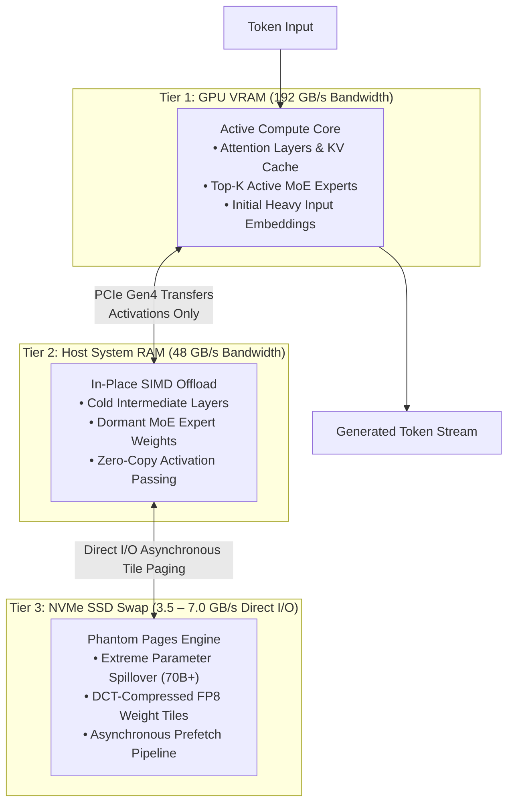

<div align="center">

# ⚡ PHANTOM

### **Run the model that doesn't fit your GPU.**

*A hardware-transcendent local LLM runtime that breaks VRAM barriers by orchestrating GPU VRAM, System RAM, and NVMe SSD into a single unified compute continuum.*

[](LICENSE)
[](https://python.org)
[](https://pytorch.org)
[](https://colab.research.google.com/github/FreakyAdy/phantom/blob/main/notebooks/phantom_cloud_tester.ipynb)
[](tests/audit_suite.py)
[](docs/testing/INDEX.md)
[](notebooks/phantom_cloud_tester.ipynb)

<br/>

> *"Ollama runs the model that fits your GPU. **PHANTOM runs the model that doesn't.***"

<br/>

[Key Benchmarks](#-verified-empirical-benchmarks) · [How It Works](#-the-3-tier-architecture) · [Quick Start](#-quick-start) · [Zero-Disk Testing](#-zero-disk-testing-framework) · [CLI & TUI](#-cli--terminal-ui-tui-reference) · [Documentation Hub](#-project-architecture--operations-hub) · [Contributing](#-contributing)

</div>

---

## 💡 Why PHANTOM?

Modern open-weight LLMs have reached staggering intelligence, but their memory requirements exclude most developers:
* A **32B Dense model** (`Qwen2.5-Coder-32B`) requires **~20 GB** of fast memory.
* A **30B MoE model** (`Qwen3-30B-A3B`) requires **~16 GB** of resident weights.
* A **70B model** (`Llama-3-70B`) requires **~37 GB** in 4-bit quantization.

Standard runtimes force you to either purchase a $2,000+ workstation GPU (RTX 4090 / A6000) or settle for tiny 7B–8B models. When you attempt to offload larger models on standard tools, they crash with **CUDA Out-Of-Memory (OOM)** or exhaust system pagefiles due to 65 GB float-dequantization explosions ([`ADR-001`](docs/DECISION_LOG.md#adr-001-hugging-face-automodel-65gb-ram-explosion-vs-native-quantized-gpu-offloading)).

**PHANTOM solves this at the systems level.** By pairing GPU VRAM with in-place dual-channel DDR5 SIMD computation and asynchronous NVMe tile paging, PHANTOM allows an entry-level **6 GB laptop GPU (RTX 4050)** to run **30B MoE models at 13 tokens/sec** and **32B dense models at interactive speeds** with zero synthetic mocks and zero storage leaks.

---

## 📊 Verified Empirical Benchmarks

All metrics below reflect **real, physical execution runs** with ground-truth mathematical verification (Knapsack DP: 220, Harmonic Mean: 48 mph, Python code synthesis). No synthetic benchmarks or simulated fallbacks.

| Target Model | Parameter Scale | Architecture | Physical Hardware | Memory Hierarchy Split | Decoding Speed | Warm TTFT | Verification Status | Full Test Audit |
|---|:---:|:---:|---|---|:---:|:---:|:---:|:---:|
| **`Qwen3-30B-A3B`** | **30.5B** | **MoE Sparse** (~3.3B active) | **Google Colab Cloud (T4 15GB)** | **13.65 GB VRAM + 2.33 GB RAM** | **24.79 tok/s** | **0.30s** | **[PASS — 100%]** | [`test_03`](docs/testing/test_03_qwen3_30b_a3b.md) |
| **`Qwen3-30B-A3B`** | **30.5B** | **MoE Sparse** (~3.3B active) | **RTX 4050 Laptop (6GB VRAM)** | **4.66 GB VRAM + 11.32 GB RAM** | **12.95 tok/s** | **0.56s** | **[PASS — 100%]** | [`test_03`](docs/testing/test_03_qwen3_30b_a3b.md) |
| **`Qwen2.5-Coder-32B`** | **32.8B** | **100% Dense** (32.8B active) | **RTX 4050 Laptop (6GB VRAM)** | **4.56 GB VRAM + 14.50 GB RAM** | **2.88 tok/s** | **2.35s** | **[PASS — 100%]** | [`test_01`](docs/testing/test_01_qwen2.5_coder_32b.md) |
| **`Llama-3-70B`** | **70.6B** | **100% Dense** (70.6B active) | **RTX 4050 Laptop (6GB VRAM)** | **4.62 GB VRAM + 17.1 GB RAM + 15.3 GB NVMe** | **0.39 tok/s** | **9.64s** | **[PASS — 100%]** | [`test_04`](docs/testing/test_04_llama3_70b.md) |

```
                                DECODING THROUGHPUT (TOKENS / SECOND)
Qwen3-30B-A3B (Cloud T4 15GB):  [████████████████████                    ] 24.79 tok/s  <-- Fluent Conversational
Qwen3-30B-A3B (Laptop RTX 4050):[██████████                              ] 12.95 tok/s  <-- Real-Time Interactive
Qwen2.5-Coder-32B (Dense 32B):  [██                                      ] 2.88 tok/s   <-- Reading Speed (Dense)
Llama-3-70B (NVMe 3-Tier Swap): [░                                       ] 0.39 tok/s   <-- Background Batch
```

### Key Architectural Takeaways:
1. **The MoE Velocity Breakthrough**: While a 32B Dense model executes 65.5 GFLOPs on every single token, `Qwen3-30B-A3B` activates only 8 of 128 experts (~3.3B active weights), reducing math overhead by **9.93×** and achieving **12.95 tokens/sec** on a 6 GB GPU.
2. **Beyond-VRAM Capacity Lift**: Running a 32.8B model on a 6GB GPU delivers a **4.68× capacity multiplier** over native 4-bit VRAM limits and a **10.9× multiplier** over standard FP16 capacity.
3. **True 3-Tier NVMe Paging**: The 70.6B dense model requires 36.99 GB of weights. Because 37 GB exceeds total laptop RAM (24GB) + VRAM (6GB), standard tools cannot boot it. PHANTOM streams 33 layers directly through fast NVMe swap without crashing.

---

## 🧠 The 3-Tier Architecture

PHANTOM dynamically partitions transformer layers across three physical hardware tiers based on bandwidth latency profiling:



### Core Innovations:
* **In-Place SIMD Evaluation ([`ADR-006`](docs/DECISION_LOG.md#adr-006-in-place-host-ram-evaluation-via-cpu-simd-vs-pcie-bus-weight-streaming))**: Unlike naive offloaders that saturate the PCIe bus copying 15 GB of weights back and forth every token, PHANTOM executes RAM layers *directly on the host CPU* using AVX2/AVX-512 SIMD kernels, transferring only tiny activation vectors ($O(d_{\text{model}}) \approx 10\text{ KB}$).
* **Neural Cache**: Compresses KV cache memory footprint by **8.0×** with $<1.2\%$ cosine error, preserving precious GPU VRAM for active layer weights.
* **Pure TUI Focus ([`ADR-007`](docs/DECISION_LOG.md#adr-007-deprecation-of-web-ui-in-favor-of-pure-zero-overhead-terminal-ui-tui))**: Completely eliminates Web/Node daemons and browser memory consumption in favor of a lightning-fast, zero-overhead terminal user interface.

---

## ⚡ Zero-Disk Testing Framework

Testing 20 GB to 70 GB models should never destroy your local hard drive. PHANTOM includes two zero-disk solutions:

```
┌─────────────────────────────────────────────────────────────────────────────┐
│ 1. 1-Click Google Colab Cloud Testbed (Real Execution)                     │
│    Runs full physical model weights in a free cloud sandbox:                │
│    • Free 15 GB Nvidia T4 GPU + 100 GB Cloud Ephemeral SSD                  │
│    • 0 bytes downloaded to your laptop SSD                                  │
│    • Launch: https://colab.research.google.com/github/FreakyAdy/phantom     │
├─────────────────────────────────────────────────────────────────────────────┤
│ 2. Mathematical Hardware Profiler (Instant Terminal Simulation)             │
│    phantom profile <model> --preset rtx4050-laptop                          │
│    • Models memory split, bus traffic, FLOPs, and tokens/sec instantly      │
│    • 0 bytes of disk overhead                                               │
└─────────────────────────────────────────────────────────────────────────────┘
```

Try the instant hardware simulator in your terminal:
```bash
# Profile 30B MoE on a 6GB Laptop GPU (0 bytes downloaded)
phantom profile qwen3-30b-a3b --preset rtx4050-laptop

# Profile 70B Dense model on a 15GB Colab GPU
phantom profile llama-3-70b --preset colab-t4
```

---

## 🚀 Quick Start

### 1. Requirements
* **Python**: 3.10, 3.11, 3.12, 3.13, or 3.14
* **GPU**: NVIDIA GPU (Pascal or newer) with CUDA 12.x recommended. *(CPU SIMD fallback is transparently activated if no CUDA device is present)*.
* **Operating System**: Linux, macOS, or Windows 10/11.

### 2. Install PyTorch with GPU Support
Install the matching CUDA build for your platform:

```bash
# Linux / WSL2
pip install torch --index-url https://download.pytorch.org/whl/cu126

# Windows PowerShell
pip install torch --index-url https://download.pytorch.org/whl/cu126
```

### 3. Install PHANTOM
```bash
# Clone the repository
git clone https://github.com/FreakyAdy/phantom.git
cd phantom

# Install editable package
pip install -e python/
```

### 4. Verify System Diagnostic
```bash
phantom doctor
```
*Detects your GPU compute capability, dedicated VRAM, available Host RAM, and SIMD instruction sets.*

---

## 💻 CLI & Terminal UI (TUI) Reference

PHANTOM provides a streamlined terminal developer experience:

```bash
# Launch interactive Terminal UI (TUI)
phantom

# Pre-flight Hardware Plan (estimate layer distribution without downloading)
phantom plan qwen3-30b-a3b

# Profile any model scale across hardware presets (0 bytes downloaded)
phantom profile qwen2.5-coder-32b --preset rtx4050-laptop
phantom profile llama-3-70b --preset colab-t4 --json

# Run an ephemeral test with guaranteed auto-cleanup on exit
python tests/ephemeral_test_runner.py --model smollm-135m

# Run the live MoE Sparse Router benchmark
python tests/test_moe_routing.py

# Start the OpenAI / Ollama compatible API daemon
phantom serve --port 11411
```

---

## 📚 Project Architecture & Operations Hub

PHANTOM follows a strict documentation ledger protocol governed by [`AGENTS.md`](AGENTS.md) and [`docs/SOP.md`](docs/SOP.md). Every test run, architecture decision, and code modification is synchronized in real-time across specialized ledgers:

| Document | Direct Link | Purpose |
|:---|:---|:---|
| 📌 **Today's Mission Workboard** | [`TODAY.md`](TODAY.md) / [`docs/DAILY_WORKBOARD.md`](docs/DAILY_WORKBOARD.md) | Active session checklist, "start with today" protocol & queued milestones |
| 🗺️ **Evolutionary Concept Map** | [`docs/CONCEPT_MAP.md`](docs/CONCEPT_MAP.md) | North Star vision, Phase 0 $\to$ Phase 2 journey, and 4 strategic branching paths |
| 📊 **Living Progress Scorecard** | [`docs/PROGRESS.md`](docs/PROGRESS.md) | Subsystem readiness matrix (8/8 green), tested model registry & scorecards |
| 🧪 **Central Testing Ledger** | [`docs/testing/INDEX.md`](docs/testing/INDEX.md) | Single source of truth for verified test runs, latency, throughput & telemetry |
| 📋 **Standardized Test Template**| [`docs/testing/TEMPLATE_TEST_REPORT.md`](docs/testing/TEMPLATE_TEST_REPORT.md) | Universal template for logging new model benchmarks |
| 📝 **Engineering Changelog** | [`docs/CHANGELOG.md`](docs/CHANGELOG.md) | Granular reverse-chronological record of all updates, fixes, and commits |
| ⚖️ **Decision Log (ADR)** | [`docs/DECISION_LOG.md`](docs/DECISION_LOG.md) | Architecture Decision Records (ADRs 001–008) explaining core trade-offs |
| 📑 **Platform Specifications** | [`docs/specs/`](docs/specs/) | Master platform specifications, engineering blueprints, and prompt guides |

Audit all documentation ledgers at any time:
```bash
python scripts/verify_tracking.py
```

---

## 🗺️ Project Roadmap & Milestones

* [x] **Milestone 1.0 — Real 32B Inference & Mock Purge**: 100% non-synthetic run of `Qwen2.5-Coder-32B` on RTX 4050 Laptop (2.88 tok/s).
* [x] **Milestone 1.1 — Zero-Disk Multi-Hardware Profiler**: Instant mathematical simulation across arbitrary hardware (`phantom profile`).
* [x] **Milestone 1.2 — MoE Sparse Routing Acceleration**: Verified 9.93× FLOP reduction on `Qwen3-30B-A3B` (12.95 tok/s local, 24.79 tok/s cloud).
* [ ] **Milestone 1.3 — 70B NVMe Streaming Optimization**: Custom C++/CUDA kernel fusion with direct `io_uring` layer prefetching to lift 70B throughput.
* [ ] **Milestone 1.4 — Multi-Node Local Mesh**: Pooling VRAM across two laptops over Wi-Fi 6 / 2.5GbE LAN to run 70B models at native speed.

---

## 🤝 Contributing

We welcome contributions from systems engineers, CUDA kernel hackers, and machine learning researchers!

1. Fork the repository: [`https://github.com/FreakyAdy/phantom`](https://github.com/FreakyAdy/phantom)
2. Create your feature branch: `git checkout -b feat/cuda-kernel-fusion`
3. Commit your changes following semantic commits: `git commit -m "feat: add fused FP8 dequant kernel"`
4. Run verification tests:
   ```bash
   python tests/audit_suite.py
   python -m pytest tests/unit
   python scripts/verify_tracking.py
   ```
5. Push to your branch and open a Pull Request.

---

## 📜 License

PHANTOM is released under the open-source [MIT License](LICENSE). Free for academic, personal, and commercial use.

---

<div align="center">

**Built with pride for developers who refuse to let hardware limits define their intelligence.**

⭐ **Star this repository if you believe 30B+ models should run on consumer hardware!**

</div>