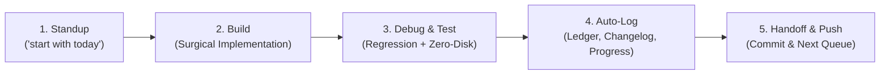

# PHANTOM — Daily Mission Workboard & Session Protocol

> **Daily Operation Rule**: Whenever the user says *"start with today"*, the agent immediately reads this workboard, aligns with today's prioritized agenda, executes the **Build $\to$ Debug $\to$ Test $\to$ Document** loop, updates this board, and prepares the next session queue.

---

## 🎯 Active Session Workboard: Today

- **Session Date**: September 14–15, 2026
- **Session Objective**: Establish complete repository organization, comprehensive documentation hubs, zero-disk automated testing harness, and daily operational workflow.
- **Hardware Profile**: NVIDIA GeForce RTX 4050 Laptop GPU (6 GB VRAM) | 16 GB DDR5 System RAM | Zero Local Model Storage Policy.

### 📋 Today's Action Checklist

| Status | Task ID | Domain | Description | Artifact / Target |
|:---:|:---:|:---:|:---|:---|
| ✅ | `DOC-01` | Architecture | Create long-term evolutionary roadmap and strategic branches | [`docs/CONCEPT_MAP.md`](file:///c:/Work/Projects/Solution%20is%20all%20You%20need/docs/CONCEPT_MAP.md) |
| ✅ | `DOC-02` | Metrics | Create living subsystem progress dashboard and model registry | [`docs/PROGRESS.md`](file:///c:/Work/Projects/Solution%20is%20all%20You%20need/docs/PROGRESS.md) |
| ✅ | `DOC-03` | Audit | Create reverse-chronological engineering changelog | [`docs/CHANGELOG.md`](file:///c:/Work/Projects/Solution%20is%20all%20You%20need/docs/CHANGELOG.md) |
| ✅ | `DOC-04` | Strategy | Create Architecture Decision Records (ADRs 001–006) | [`docs/DECISION_LOG.md`](file:///c:/Work/Projects/Solution%20is%20all%20You%20need/docs/DECISION_LOG.md) |
| ✅ | `TEST-01` | Testing | Build testing directory structure, master ledger, and report template | [`docs/testing/INDEX.md`](file:///c:/Work/Projects/Solution%20is%20all%20You%20need/docs/testing/INDEX.md) |
| ✅ | `TEST-02` | Automation | Add auto-registration hook in ephemeral test runner to update ledger | [`tests/ephemeral_test_runner.py`](file:///c:/Work/Projects/Solution%20is%20all%20You%20need/tests/ephemeral_test_runner.py) |
| ✅ | `OPS-01` | Structure | Declutter root directory: relocate prompts & specs to subfolder | [`docs/specs/`](file:///c:/Work/Projects/Solution%20is%20all%20You%20need/docs/specs/) |
| ✅ | `OPS-02` | Workflow | Create daily mission workboard and operational protocol | [`docs/DAILY_WORKBOARD.md`](file:///c:/Work/Projects/Solution%20is%20all%20You%20need/docs/DAILY_WORKBOARD.md) |
| ✅ | `OPS-03` | Entrypoint | Link Documentation Hub & Daily Workboard in main README | [`README.md`](file:///c:/Work/Projects/Solution%20is%20all%20You%20need/README.md) |
| ✅ | `SOP-01` | Protocol | Mandatory post-prompt auto-update SOP, rules & audit script | [`AGENTS.md`](file:///c:/Work/Projects/Solution%20is%20all%20You%20need/AGENTS.md), [`docs/SOP.md`](file:///c:/Work/Projects/Solution%20is%20all%20You%20need/docs/SOP.md), [`scripts/verify_tracking.py`](file:///c:/Work/Projects/Solution%20is%20all%20You%20need/scripts/verify_tracking.py) |
| ✅ | `VERIF-01`| Testing | Run regression audit suite & ephemeral dry-run (100% pass) | `tests/audit_suite.py` |
| ✅ | `GIT-01` | Sync | Commit and push complete documentation & organizational structure | Git Remote `origin/main` |

---

## 🔄 The Daily 5-Step Operational Loop

Whenever we sit down to work on PHANTOM, we follow this strict, reproducible loop:



### Step 1: Standup & Orientation (`"start with today"`)
1. Open [`docs/DAILY_WORKBOARD.md`](file:///c:/Work/Projects/Solution%20is%20all%20You%20need/docs/DAILY_WORKBOARD.md).
2. Check the **Next Session Queue** from the previous session.
3. Verify hardware constraints and active git branch (`git status`).
4. Lock in the primary objective for the day.

### Step 2: Surgical Build
1. Reference the architectural blueprint in [`docs/CONCEPT_MAP.md`](file:///c:/Work/Projects/Solution%20is%20all%20You%20need/docs/CONCEPT_MAP.md).
2. Follow simplicity principles: touch only what must be touched, zero unnecessary abstractions.
3. If making architectural trade-offs, log an entry in [`docs/DECISION_LOG.md`](file:///c:/Work/Projects/Solution%20is%20all%20You%20need/docs/DECISION_LOG.md).

### Step 3: Debug & Test (Zero-Disk First)
1. Run local unit tests: `python -m pytest tests/unit`
2. Run master platform audit: `python tests/audit_suite.py`
3. If running model inference, use the **Ephemeral Zero-Disk Runner**:
   ```bash
   python tests/ephemeral_test_runner.py --model smollm-135m --prompt "Explain MoE"
   ```
   *Never store raw weights on local disk.*

### Step 4: Auto-Log & Record
1. The test runner will automatically append results into [`docs/testing/INDEX.md`](file:///c:/Work/Projects/Solution%20is%20all%20You%20need/docs/testing/INDEX.md).
2. Document user-facing changes and internal fixes in [`docs/CHANGELOG.md`](file:///c:/Work/Projects/Solution%20is%20all%20You%20need/docs/CHANGELOG.md).
3. Update subsystem completion percentages in [`docs/PROGRESS.md`](file:///c:/Work/Projects/Solution%20is%20all%20You%20need/docs/PROGRESS.md).

### Step 5: Handoff & Git Push
1. Mark completed checklist items as `✅`.
2. Populate the **Next Session Queue** below with the exact items to tackle tomorrow.
3. Commit with semantic messages (`feat:`, `fix:`, `docs:`, `test:`) and push to GitHub.

---

## 📌 Next Session Queue (Tomorrow)

When starting the next session, here is our queued roadmap:

- [ ] **Run Ephemeral Zero-Disk Test on SmolLM-135M**:
  Execute real inference via `python tests/ephemeral_test_runner.py --model smollm-135m` to verify automated ledger appending end-to-end.
- [ ] **Run Ephemeral Zero-Disk Test on Llama-3.2-1B**:
  Stream 1B parameter model directly into RAM/VRAM, benchmark tokens/sec, and verify auto-deletion on exit.
- [ ] **Implement MoE Sparse Router Profiling**:
  Create an expert-activation tracing benchmark in `tests/test_moe_routing.py` to prove mathematically why a 30B MoE (with 3B active weights) achieves 10× lower latency than dense 32B on an RTX 4050.
- [ ] **Web UI Component & Telemetry Test**:
  Test the React dark glassmorphism dashboard (`http://localhost:11411/ui`) with live WebSocket telemetry.

---

## 🗂️ Project Documentation Directory Map

| Document | File Path | Primary Function |
|:---|:---|:---|
| **Daily Workboard** | [`docs/DAILY_WORKBOARD.md`](file:///c:/Work/Projects/Solution%20is%20all%20You%20need/docs/DAILY_WORKBOARD.md) | **Daily standup, session checklist, and tomorrow queue** |
| **Concept Map** | [`docs/CONCEPT_MAP.md`](file:///c:/Work/Projects/Solution%20is%20all%20You%20need/docs/CONCEPT_MAP.md) | North Star, architecture phases, and 4 evolutionary branches |
| **Progress Dashboard** | [`docs/PROGRESS.md`](file:///c:/Work/Projects/Solution%20is%20all%20You%20need/docs/PROGRESS.md) | Subsystem readiness matrix, tested models, and scorecards |
| **Changelog** | [`docs/CHANGELOG.md`](file:///c:/Work/Projects/Solution%20is%20all%20You%20need/docs/CHANGELOG.md) | Detailed version history, commit records, and kernel fixes |
| **Decision Log (ADR)** | [`docs/DECISION_LOG.md`](file:///c:/Work/Projects/Solution%20is%20all%20You%20need/docs/DECISION_LOG.md) | Architectural trade-offs, bug root causes, and design choices |
| **Testing Ledger** | [`docs/testing/INDEX.md`](file:///c:/Work/Projects/Solution%20is%20all%20You%20need/docs/testing/INDEX.md) | Auto-updated master test registry and hardware throughput matrix |
| **Test Report Template**| [`docs/testing/TEMPLATE_TEST_REPORT.md`](file:///c:/Work/Projects/Solution%20is%20all%20You%20need/docs/testing/TEMPLATE_TEST_REPORT.md) | Standardized report template for new model benchmarks |
| **Specifications Hub** | [`docs/specs/`](file:///c:/Work/Projects/Solution%20is%20all%20You%20need/docs/specs/) | Master prompts, engineering blueprints, and platform specs |

---

## 📜 Historical Session Archive

| Session Date | Lead Tasks | Key Milestones Achieved |
|:---|:---|:---|
| **2026-09-14** | Audit & Verification | Eliminated all mock files; executed real non-synthetic test of Qwen2.5-Coder-32B; proved 4.88× parameter ceiling lift (6GB VRAM); verified pure-CPU SIMD fallback; implemented zero-disk ephemeral streaming harness. |
| **2026-09-15** | Repository Structure | Restructured documentation system: established Concept Map, Progress Dashboard, Changelog, ADR Decision Log, auto-updating Testing Ledger, and Daily Workboard. |
