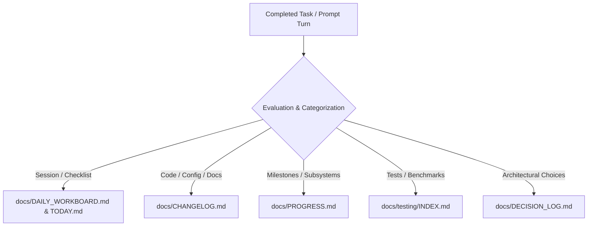

# PHANTOM — Standard Operating Procedure (SOP): Autonomous Progress Tracking

> **Document ID**: `SOP-OPS-001`  
> **Version**: 1.0.0  
> **Effective Date**: 2026-09-15  
> **Target Audience**: AI Agents (Antigravity), Core Maintainers, Contributors  

---

## 1. Purpose & Scope

The purpose of this SOP is to ensure that the state, progress, architecture decisions, and test history of the **PHANTOM** platform are continually, accurately, and deterministically tracked in real-time. 

To prevent information fragmentation and lost context across sessions, **all AI agents and human contributors must update the dedicated tracking documents after every completed prompt or task execution.**

---

## 2. The 5 Living Documentation Ledgers

The repository maintains five distinct ledgers, each with a single responsibility:



### Ledger 1: Daily Workboard (`TODAY.md` & `docs/DAILY_WORKBOARD.md`)
- **Scope**: Session-level agenda, active tasks, blockers, and next-session handoff.
- **Trigger**: Every single prompt completion.
- **Action**: Check off completed items (`- [x]`), adjust task descriptions if scope expanded, update the "Next Session Queue".

### Ledger 2: Engineering Changelog (`docs/CHANGELOG.md`)
- **Scope**: Reverse-chronological log of every technical change.
- **Trigger**: Any file addition, modification, deletion, or bug fix.
- **Action**: Append bullet points under `## [Unreleased]` categorized by `Added`, `Changed`, `Fixed`, or `Optimized`, citing exact filenames.

### Ledger 3: Subsystem Progress Tracker (`docs/PROGRESS.md`)
- **Scope**: High-level platform health, readiness scores, and milestone history.
- **Trigger**: Subsystem improvements, test suite changes, or capability advancements.
- **Action**: Update readiness percentages (e.g. 100% Pass), record completed milestones in the chronological ledger.

### Ledger 4: Testing & Telemetry Ledger (`docs/testing/INDEX.md`)
- **Scope**: Central record of all model executions, benchmark throughputs, and hardware load metrics.
- **Trigger**: Any execution of `tests/ephemeral_test_runner.py`, `tests/audit_suite.py`, or unit tests.
- **Action**: Auto-register test runs via `register_test_in_ledger()` or manual table insertion.

### Ledger 5: Architecture Decision Log (`docs/DECISION_LOG.md`)
- **Scope**: ADR records detailing the context, rationale, and consequences of design choices.
- **Trigger**: Any architectural trade-off (e.g., zero-disk policy, memory layouts, SIMD kernels).
- **Action**: Append a formatted ADR entry (`ADR-00X`).

---

## 3. Step-by-Step Post-Prompt Verification Protocol

At the end of every prompt or turn, execute this quick audit:

1. **Did I change code or configuration?**
   - If YES $\to$ add entry to `docs/CHANGELOG.md`.
2. **Did I run or create tests?**
   - If YES $\to$ ensure test row in `docs/testing/INDEX.md` or update test score.
3. **Did I complete a checklist item or change project status?**
   - If YES $\to$ check off item in `docs/DAILY_WORKBOARD.md` and `TODAY.md`.
4. **Did I advance subsystem readiness or complete a milestone?**
   - If YES $\to$ update `docs/PROGRESS.md`.
5. **Did I make a non-obvious design trade-off?**
   - If YES $\to$ log an ADR in `docs/DECISION_LOG.md`.

---

## 4. Automated SOP Health Check

A dedicated verification utility is provided in `scripts/verify_tracking.py` to evaluate the integrity and freshness of all tracking documents:

```bash
python scripts/verify_tracking.py
```

This utility verifies:
- All 5 ledgers exist and are formatted correctly.
- `TODAY.md` points to an active workboard.
- Recent changes are documented in `CHANGELOG.md`.
- No broken links exist within the documentation hub.
